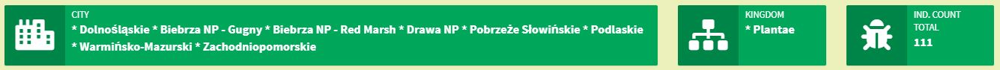

<!-- README.md is generated from README.Rmd. Please edit that file -->

```{r, include = FALSE}
knitr::opts_chunk$set(
  collapse = TRUE,
  comment = "#>",
  fig.path = "man/figures/README-",
  out.width = "100%"
)
```

# biodiversityapp


# Overview
Application is based on biodiversity data provided by **APPSILON**.\
\
**shiny**, **shinydashboard**, **shinyWidgets** and **timevis** packages are mainly used for the application and the
tests are conducted by **testthat** package.\

Basically, users search for a name of the species in **searchInput** field and the matching results are displayed on 
**selectInput** field. Users can search with both *vernacular* and *scientific*  name of the species.\

Results are summarized with 3 **infoBoxOutput**, 3 **plotOutput**, 1 **leafletOutput** and 1 **timevisOutput**.\

<span style = "text-decoration: underline">**infoBoxOutput (by month)**</span>\
There are 3 infoBoxOutputs in a row;\
**Left:** All the cities are listed for the selected species.\
**Middle:** The kingdom of the selected species is shown.\
**Right:** Individual count total for the selected species is calculated.\

\

<span style = "text-decoration: underline">**plotOutput (by month)**</span>\
Data for selected species is grouped by **month** and the total individual counts are displayed on bar graph. You can 
easily see in which month the selected species is observed mostly.

\


<span style = "text-decoration: underline">**plotOutput (by year)**</span>\
Data for selected species is grouped by **year** and the total individual counts are displayed on line graph. You can easily follow the change across years for the selected species.\

\


<span style = "text-decoration: underline">**plotOutput (by city)**</span>\
Data for selected species is grouped by **city** and the total individual counts are displayed on horizontal bar graph. The cities are located in a descending order according to total individual counts.\

\

<span style = "text-decoration: underline">**leafletOutput**</span>\
Longitude and Latitude information are used to visualize observed species on the map. You can also see the number
of individual counts on markers.

\

<span style = "text-decoration: underline">**timevisOutput**</span>\
The cities where the selected species are observed are shown on time visualization output.\

\

# Installation

Latest version of the application can be downloaded from [Github](https://github.com/) repository using the following command:

```r
# install.packages("devtools")
devtools::install_github("gokhankocturk/biodiversityapp")
```

# Package Tree
General structure of the package is as follows:
```r
+-- biodiversityapp.Rproj
+-- data
|   \-- occurence.rda
+-- DESCRIPTION
+-- LICENSE
+-- LICENSE.md
+-- man
|   +-- biodiversityapp.Rd
|   +-- infoUI.Rd
|   +-- maptimeUI.Rd
|   \-- selectUI.Rd
+-- NAMESPACE
+-- R
|   +-- app.R
|   +-- data_for_map.R
|   +-- data_for_selectinput.R
|   +-- data_raw_check.R
|   +-- info_module.R
|   +-- maptime_module.R
|   \-- select_module.R
+-- README.md
+-- README.Rmd
+-- tests
|   +-- testthat
|   |   +-- test-data_for_map.R
|   |   +-- test-data_for_selectinput.R
|   |   \-- test-data_raw_check.R
|   \-- testthat.R
\-- www
    +-- biodiversity.jpg
    +-- by_city.JPG
    +-- by_month.JPG
    +-- by_year.JPG
    +-- infoBoxOutput.JPG
    +-- map.JPG
    \-- timevis.JPG
```
\

# Usage
Biodiversity app can be run in 2 ways;\
1. Biodiversity app is deployed on "shinyapps.io" platform and available at [here](https://gokhankocturk.shinyapps.io/marinedata_shinyapp/)\
2. You can also run the app with "**biodiversityapp()**" function as follows:\
```r
library(biodiversityapp)
biodiversityapp()
```
\

# Data Description

**scientificName** - scientific name for species\
**vernacularName** - vernacular name for species\
**kingdom** - kingdom which the species belong\
**family** - family which the species belong\
**individualCount** - number of individual counts per observation\
**LON** - longitude\
**LAT** - latitude\
**country** - country\
**countryCode** - country code\
**start** - date of the observation\
**town** - town\
**year** - year\
**month_name** - month\

# Unit Tests
For simple apps, it may be easy to remember and follow how the app works, so that you can
easily adapt new features without breaking the existing code. But for larger apps, the structure
will be complicated and hard to follow the effects of the changes you made. At this point, 
we need **unit tests** to make the process easier. As Hadley Wickham stated *"Testing is a way 
to capture desired behaviour of your code, in such a way that you can automatically verify 
that it keeps working the way you expect."*\
\

3 different unit tests are written for **biodiversityapp** by using **testthat** package:\

## test-data_raw_check.R
**Explanation**\
Core variables like "LON", "LAT", "town" and "individualCount" must not have any missing (NA) values. For this reason, raw data must be checked to see the potential problems in advance.\

In this unit test we check whether these variables have missing values or not.\ 

**How to use it?**\
We run the unit test by using **test_file()** function from **devtools** package as follows:\
```{r, eval = FALSE}
devtools::test_file("test-data_raw_check.R")
```

**Output**\
It is a brief explanation about how many tests are passed or failed.\


## test-data_for_map.R
**Explanation**\
Users can search species by their scientific and vernacular name typing in **searchInput** and selecting matched name from **selectInput** in biodiversityapp. You can search by typing either full name or a substring. If correct match exists, the data
is created for map.\

In this unit test we check whether the data is created accurately for different searches. 

**How to use it?**\
We run the unit test by using **test_file()** function from **devtools** package as follows:\
```{r, eval = FALSE}
devtools::test_file("test-data_for_map.R")
```

**Output**\
It is a brief explanation about how many tests are passed or failed.\


## test-data_for_selectinput.R
**Explanation**\
**selectInput** choices are updated according to user's searches. These choices must not include any
missing (NA) values.\

In this unit test we check whether the **selectInput** choices are created accurately for different searches. 

**How to use it?**\
We run the unit test by using **test_file()** function from **devtools** package as follows:\
```{r, eval = FALSE}
devtools::test_file("test-data_for_selectInput.R")
```

**Output**\
It is a brief explanation about how many tests are passed or failed.\


